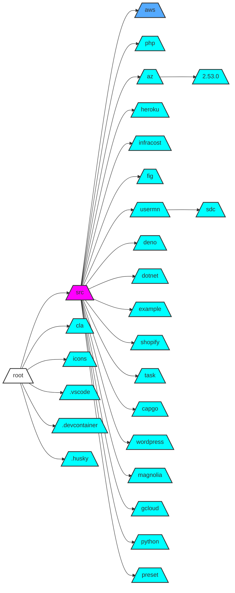

# Commit Cartographer

A Python tool that generates visual flowcharts of Git repository activity by analyzing commit patterns across directories.

## Features

- 🔍 **Intelligent Analysis**: Counts commits per directory while focusing only on currently existing files
- 📊 **Visual Representation**: Generates Mermaid flowcharts with directory relationships
- 🎨 **Color Gradients**: Uses a 10-step color gradient to represent commit density
- 🌳 **Directory Depth**: Supports up to 4 levels of directory nesting
- 📁 **Repository Structure**: Shows parent-child relationships between directories


## Installation

To use this project, ensure you have [uv](https://github.com/astral-sh/uv) installed.

## Usage

To run the tool, execute the following command in your terminal:

```bash
uv run git-activity.py [path_to_your_repo]
```

If no path is provided, it defaults to the current directory.

## Output

The script generates a Markdown file named `git-activity.md`, which contains the Mermaid flowchart diagram representing the commit activity in the specified Git repository.

## Example

After running the script, you will find a `git-activity.md` file with content similar to the following:



## Contributing

Contributions are welcome! Please feel free to submit a pull request or open an issue for any suggestions or improvements.