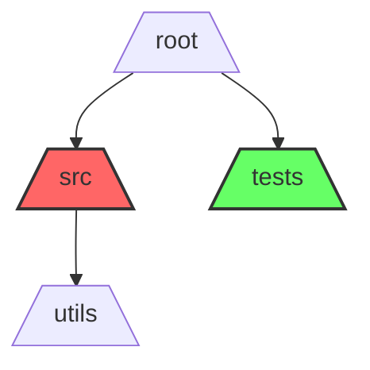

# Commit Cartographer 🗺️

A Python tool that generates visual representations of Git repository activity by analyzing commit patterns across directories and files.

## Features

- 🔍 **Intelligent Analysis**: Analyzes commit patterns across your repository's structure
- 📊 **Multiple Visualization Styles**: 
  - Mermaid flowcharts with directory relationships
  - ASCII tree view for terminal-friendly output
- 🎨 **Smart Coloring**: Uses color gradients in Mermaid mode to represent commit density
- 🌳 **Configurable Depth**: Supports up to 4 levels of directory nesting
- 📁 **Flexible Output**: Choose between showing only directories or including individual files
- 🚀 **Easy Integration**: Works as a CLI tool or can be imported as a Python package

## Installation

Install from PyPI using pip:

```
pip install commit-cartographer
```

## Usage

### Command Line Interface

The package installs a `cmap` command that you can use directly:

```
# Basic usage (creates mermaid diagram)
cmap

# Specify a repository path
cmap -p /path/to/repo

# Generate a tree view instead of mermaid
cmap --style tree

# Include files in the output (works with both styles)
cmap --verbose

# Customize the output file
cmap -o my-diagram.md
```

### Options

- `-p, --path`: Path to Git repository (default: current directory)
- `-o, --output`: Output file path (default: git_activity.md)
- `--style`: Output style - 'mermaid' or 'tree' (default: mermaid)
- `--max-depth`: Maximum folder depth to display (default: 4)
- `--verbose`: Include files in the diagram (default: directories only)

## Output Examples

### Mermaid Style


### Tree Style
```
root/
└── src/ (15 commits)
    └── utils/ (8 commits)
└── tests/ (5 commits)
```

With `--verbose` flag:
```
root/
└── src/ (15 commits)
    └── utils/ (8 commits)
        └── helpers.py (3 commits)
        └── config.py (2 commits)
    └── main.py (5 commits)
└── tests/ (5 commits)
    └── test_main.py (2 commits)
```

## Use Cases

- Understand which parts of your codebase receive the most attention
- Identify hot spots in your repository that might need refactoring
- Generate documentation about repository structure and activity
- Analyze team focus areas in large projects

## Contributing

Contributions are welcome! Here's how you can help:

1. Fork the repository
2. Create a feature branch (`git checkout -b feature/amazing-feature`)
3. Commit your changes (`git commit -m 'Add amazing feature'`)
4. Push to the branch (`git push origin feature/amazing-feature`)
5. Open a Pull Request
