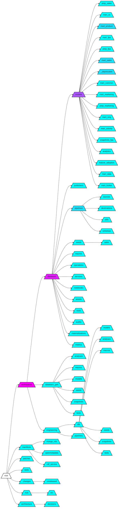

# Git Repository Activity Diagram

```mermaid
flowchart LR
    root_node[/root\]
    style root_node fill:#ffffff,stroke:#333,stroke-width:2px
    root_node --> node_workspaces[/workspaces\]
    style node_workspaces fill:#ff00ff,stroke:#333,stroke-width:2px
    node_workspaces --> node_workspaces_datateam[/datateam\]
    style node_workspaces_datateam fill:#e21cff,stroke:#333,stroke-width:2px
    node_workspaces_datateam --> node_workspaces_datateam_models[/models\]
    style node_workspaces_datateam_models fill:#aa55ff,stroke:#333,stroke-width:2px
    node_workspaces_datateam_models --> node_workspaces_datateam_models_prep_sales[/prep_sales\]
    style node_workspaces_datateam_models_prep_sales fill:#00ffff,stroke:#333,stroke-width:2px
    node_workspaces_datateam_models --> node_workspaces_datateam_models_mart_cs[/mart_cs\]
    style node_workspaces_datateam_models_mart_cs fill:#00ffff,stroke:#333,stroke-width:2px
    node_workspaces_datateam_models --> node_workspaces_datateam_models_mart_product[/mart_product\]
    style node_workspaces_datateam_models_mart_product fill:#1ce2ff,stroke:#333,stroke-width:2px
    node_workspaces_datateam_models --> node_workspaces_datateam_models_mart_fpa[/mart_fpa\]
    style node_workspaces_datateam_models_mart_fpa fill:#00ffff,stroke:#333,stroke-width:2px
    node_workspaces_datateam_models --> node_workspaces_datateam_models_prep_fpa[/prep_fpa\]
    style node_workspaces_datateam_models_prep_fpa fill:#00ffff,stroke:#333,stroke-width:2px
    node_workspaces_datateam_models --> node_workspaces_datateam_models_mart_sales[/mart_sales\]
    style node_workspaces_datateam_models_mart_sales fill:#1ce2ff,stroke:#333,stroke-width:2px
    node_workspaces_datateam --> node_workspaces_datateam_publishers[/publishers\]
    style node_workspaces_datateam_publishers fill:#00ffff,stroke:#333,stroke-width:2px
    node_workspaces_datateam --> node_workspaces_datateam_pipelines[/pipelines\]
    style node_workspaces_datateam_pipelines fill:#1ce2ff,stroke:#333,stroke-width:2px
    node_workspaces_datateam --> node_workspaces_datateam_seeds[/seeds\]
    style node_workspaces_datateam_seeds fill:#00ffff,stroke:#333,stroke-width:2px
    node_workspaces_datateam_seeds --> node_workspaces_datateam_seeds_sales[/sales\]
    style node_workspaces_datateam_seeds_sales fill:#00ffff,stroke:#333,stroke-width:2px
    node_workspaces_datateam_models --> node_workspaces_datateam_models__deprecated[/_deprecated\]
    style node_workspaces_datateam_models__deprecated fill:#1ce2ff,stroke:#333,stroke-width:2px
    node_workspaces_datateam_models --> node_workspaces_datateam_models_mart_common[/mart_common\]
    style node_workspaces_datateam_models_mart_common fill:#00ffff,stroke:#333,stroke-width:2px
    node_workspaces_datateam_models --> node_workspaces_datateam_models_mart_marketing[/mart_marketing\]
    style node_workspaces_datateam_models_mart_marketing fill:#00ffff,stroke:#333,stroke-width:2px
    node_workspaces_datateam --> node_workspaces_datateam_macros[/macros\]
    style node_workspaces_datateam_macros fill:#00ffff,stroke:#333,stroke-width:2px
    node_workspaces_datateam_pipelines --> node_workspaces_datateam_pipelines_sources[/sources\]
    style node_workspaces_datateam_pipelines_sources fill:#00ffff,stroke:#333,stroke-width:2px
    node_workspaces_datateam_models --> node_workspaces_datateam_models_prep_marketing[/prep_marketing\]
    style node_workspaces_datateam_models_prep_marketing fill:#00ffff,stroke:#333,stroke-width:2px
    root_node --> node_manifests[/manifests\]
    style node_manifests fill:#00ffff,stroke:#333,stroke-width:2px
    node_manifests --> node_manifests_mongo_cdc[/mongo_cdc\]
    style node_manifests_mongo_cdc fill:#00ffff,stroke:#333,stroke-width:2px
    node_workspaces_datateam --> node_workspaces_datateam_operations[/operations\]
    style node_workspaces_datateam_operations fill:#00ffff,stroke:#333,stroke-width:2px
    node_workspaces_datateam_models --> node_workspaces_datateam_models_mart_eng[/mart_eng\]
    style node_workspaces_datateam_models_mart_eng fill:#00ffff,stroke:#333,stroke-width:2px
    node_workspaces_datateam --> node_workspaces_datateam_services[/services\]
    style node_workspaces_datateam_services fill:#00ffff,stroke:#333,stroke-width:2px
    node_workspaces_datateam_pipelines --> node_workspaces_datateam_pipelines_destinations[/destinations\]
    style node_workspaces_datateam_pipelines_destinations fill:#00ffff,stroke:#333,stroke-width:2px
    node_workspaces_datateam --> node_workspaces_datateam_notebooks[/notebooks\]
    style node_workspaces_datateam_notebooks fill:#00ffff,stroke:#333,stroke-width:2px
    root_node --> node_patches[/patches\]
    style node_patches fill:#00ffff,stroke:#333,stroke-width:2px
    node_workspaces_datateam --> node_workspaces_datateam_assets[/assets\]
    style node_workspaces_datateam_assets fill:#00ffff,stroke:#333,stroke-width:2px
    node_workspaces_datateam_pipelines --> node_workspaces_datateam_pipelines_utils[/utils\]
    style node_workspaces_datateam_pipelines_utils fill:#00ffff,stroke:#333,stroke-width:2px
    node_workspaces_datateam_models --> node_workspaces_datateam_models_mart_activity[/mart_activity\]
    style node_workspaces_datateam_models_mart_activity fill:#00ffff,stroke:#333,stroke-width:2px
    node_workspaces_datateam_pipelines --> node_workspaces_datateam_pipelines_schemas[/schemas\]
    style node_workspaces_datateam_pipelines_schemas fill:#00ffff,stroke:#333,stroke-width:2px
    node_workspaces_datateam --> node_workspaces_datateam_tests[/tests\]
    style node_workspaces_datateam_tests fill:#00ffff,stroke:#333,stroke-width:2px
    node_workspaces_datateam --> node_workspaces_datateam_audits[/audits\]
    style node_workspaces_datateam_audits fill:#00ffff,stroke:#333,stroke-width:2px
    node_workspaces_datateam_models --> node_workspaces_datateam_models_snapshots_fpa[/snapshots_fpa\]
    style node_workspaces_datateam_models_snapshots_fpa fill:#00ffff,stroke:#333,stroke-width:2px
    node_workspaces --> node_workspaces_datateam_ga4[/datateam_ga4\]
    style node_workspaces_datateam_ga4 fill:#00ffff,stroke:#333,stroke-width:2px
    node_workspaces_datateam_ga4 --> node_workspaces_datateam_ga4_analyses[/analyses\]
    style node_workspaces_datateam_ga4_analyses fill:#00ffff,stroke:#333,stroke-width:2px
    node_workspaces_datateam_ga4 --> node_workspaces_datateam_ga4_macros[/macros\]
    style node_workspaces_datateam_ga4_macros fill:#00ffff,stroke:#333,stroke-width:2px
    node_workspaces_datateam_ga4 --> node_workspaces_datateam_ga4_models[/models\]
    style node_workspaces_datateam_ga4_models fill:#00ffff,stroke:#333,stroke-width:2px
    node_workspaces_datateam_ga4 --> node_workspaces_datateam_ga4_seeds[/seeds\]
    style node_workspaces_datateam_ga4_seeds fill:#00ffff,stroke:#333,stroke-width:2px
    node_workspaces_datateam_ga4 --> node_workspaces_datateam_ga4_snapshots[/snapshots\]
    style node_workspaces_datateam_ga4_snapshots fill:#00ffff,stroke:#333,stroke-width:2px
    node_workspaces_datateam_ga4 --> node_workspaces_datateam_ga4_tests[/tests\]
    style node_workspaces_datateam_ga4_tests fill:#00ffff,stroke:#333,stroke-width:2px
    node_workspaces_datateam --> node_workspaces_datateam_materializations[/materializations\]
    style node_workspaces_datateam_materializations fill:#00ffff,stroke:#333,stroke-width:2px
    node_workspaces_datateam_models --> node_workspaces_datateam_models_analytics[/analytics\]
    style node_workspaces_datateam_models_analytics fill:#00ffff,stroke:#333,stroke-width:2px
    root_node --> node_tests[/tests\]
    style node_tests fill:#00ffff,stroke:#333,stroke-width:2px
    root_node --> node_.changes[/.changes\]
    style node_.changes fill:#00ffff,stroke:#333,stroke-width:2px
    node_workspaces --> node_workspaces_engineering[/engineering\]
    style node_workspaces_engineering fill:#00ffff,stroke:#333,stroke-width:2px
    node_workspaces_engineering --> node_workspaces_engineering_dbt[/dbt\]
    style node_workspaces_engineering_dbt fill:#00ffff,stroke:#333,stroke-width:2px
    node_workspaces_engineering_dbt --> node_workspaces_engineering_dbt_models[/models\]
    style node_workspaces_engineering_dbt_models fill:#00ffff,stroke:#333,stroke-width:2px
    root_node --> node_rust[/rust\]
    style node_rust fill:#00ffff,stroke:#333,stroke-width:2px
    node_rust --> node_rust_src[/src\]
    style node_rust_src fill:#00ffff,stroke:#333,stroke-width:2px
    node_workspaces_datateam --> node_workspaces_datateam_metrics[/metrics\]
    style node_workspaces_datateam_metrics fill:#00ffff,stroke:#333,stroke-width:2px
    node_workspaces_datateam_models --> node_workspaces_datateam_models_feature_adoption[/feature_adoption\]
    style node_workspaces_datateam_models_feature_adoption fill:#00ffff,stroke:#333,stroke-width:2px
    node_workspaces_datateam_models --> node_workspaces_datateam_models_mart_data[/mart_data\]
    style node_workspaces_datateam_models_mart_data fill:#00ffff,stroke:#333,stroke-width:2px
    node_workspaces_datateam_models --> node_workspaces_datateam_models_mart_looker[/mart_looker\]
    style node_workspaces_datateam_models_mart_looker fill:#00ffff,stroke:#333,stroke-width:2px
    node_manifests --> node_manifests_openmetadata[/openmetadata\]
    style node_manifests_openmetadata fill:#00ffff,stroke:#333,stroke-width:2px
    node_workspaces_engineering_dbt --> node_workspaces_engineering_dbt_analyses[/analyses\]
    style node_workspaces_engineering_dbt_analyses fill:#00ffff,stroke:#333,stroke-width:2px
    node_workspaces_engineering_dbt --> node_workspaces_engineering_dbt_macros[/macros\]
    style node_workspaces_engineering_dbt_macros fill:#00ffff,stroke:#333,stroke-width:2px
    node_workspaces_engineering_dbt --> node_workspaces_engineering_dbt_seeds[/seeds\]
    style node_workspaces_engineering_dbt_seeds fill:#00ffff,stroke:#333,stroke-width:2px
    node_workspaces_engineering_dbt --> node_workspaces_engineering_dbt_snapshots[/snapshots\]
    style node_workspaces_engineering_dbt_snapshots fill:#00ffff,stroke:#333,stroke-width:2px
    node_workspaces_engineering_dbt --> node_workspaces_engineering_dbt_tests[/tests\]
    style node_workspaces_engineering_dbt_tests fill:#00ffff,stroke:#333,stroke-width:2px
    node_workspaces_engineering --> node_workspaces_engineering_pipelines[/pipelines\]
    style node_workspaces_engineering_pipelines fill:#00ffff,stroke:#333,stroke-width:2px
    node_manifests --> node_manifests_cdf_service[/cdf_service\]
    style node_manifests_cdf_service fill:#00ffff,stroke:#333,stroke-width:2px
    root_node --> node_architecture[/architecture\]
    style node_architecture fill:#00ffff,stroke:#333,stroke-width:2px
    node_architecture --> node_architecture_decisions[/decisions\]
    style node_architecture_decisions fill:#00ffff,stroke:#333,stroke-width:2px
    node_.changes --> node_.changes_unreleased[/unreleased\]
    style node_.changes_unreleased fill:#00ffff,stroke:#333,stroke-width:2px
```
